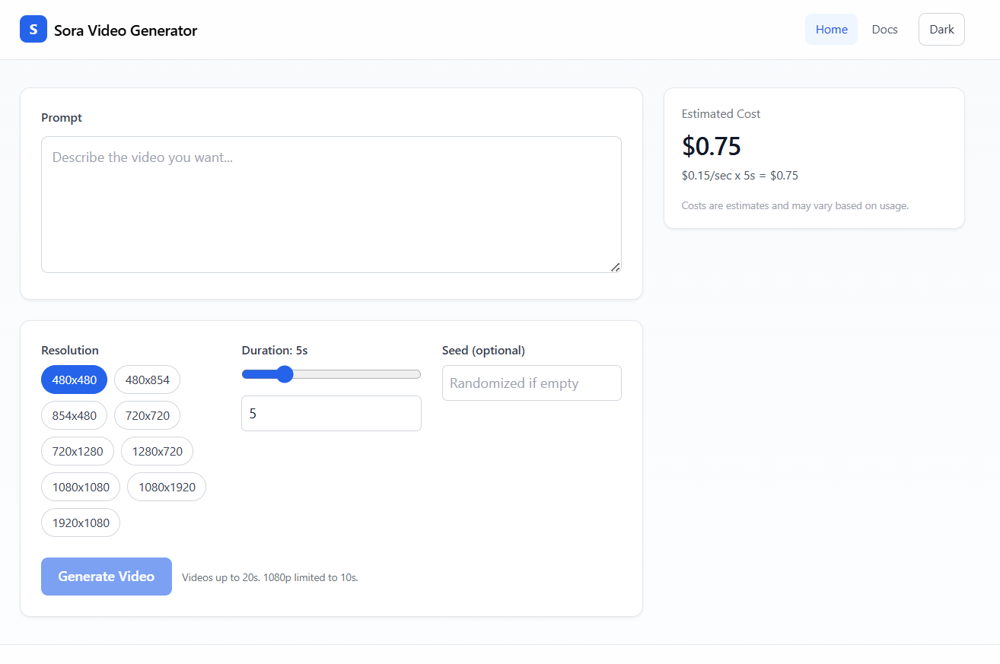
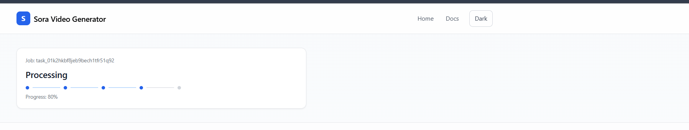

Sora Video Generator

Create short videos with a modern web UI powered by a FastAPI backend and a React + Vite frontend. Includes real-time cost estimation, smart validation, and streamlined Docker-based local setup.

## ✨ Features

- Video generation via configurable Azure OpenAI Sora deployment
- 9 supported resolutions, duration 1–20 seconds with resolution-specific caps (e.g., 1920x1080 max 10s)
- Modern SPA (Home → Status → Result) with real-time cost preview and warnings
- Async server with streaming download for large files
- Azure Managed Identity support for production; API key for local/dev
- Health checks and structured request/error logging
- Container-ready (Dockerfiles + docker-compose)

## 🖼️ UI Preview


| Home | Job Created |
| --- | --- |
|  |  |

| Processing | Video Created |
| --- | --- |
|  |  |

## 🚀 Quick Start

### Option A: Run with Docker

1) Copy/prepare environment variables (see Configuration below). For Docker, you can export them into your shell or a `.env` file at the repo root.
2) Build and start:

```powershell
docker compose up --build
```

Frontend starts on http://localhost:5173 and backend on http://localhost:8090.

### Option B: Local Dev (no Docker)

- Backend (FastAPI):
  - cd backend
  - poetry install
  - create `.env` (see Configuration) in `backend/`
  - run on port 8090:

    ```powershell
    poetry run uvicorn app.main:app --host 127.0.0.1 --port 8090
    ```

- Frontend (React + Vite):
  - cd frontend
  - npm install
  - set `VITE_API_BASE_URL=http://localhost:8090` in `frontend/.env`
  - run dev server (port 5173):

    ```powershell
    npm run dev
    ```

## ⚙️ Configuration

Backend environment variables (place in `backend/.env` for local dev):

```
AZURE_OPENAI_ENDPOINT=
AZURE_OPENAI_API_KEY=
AZURE_OPENAI_API_VERSION=preview
AZURE_OPENAI_DEPLOYMENT=sora
AZURE_OPENAI_MODEL=sora
AZURE_USE_MANAGED_IDENTITY=false
STORAGE_DIR=./storage
BASE_URL=http://localhost:8090
```

Notes
- Set `AZURE_USE_MANAGED_IDENTITY=true` in Azure environments (and omit the API key).
- Frontend expects `VITE_API_BASE_URL` pointing to the backend (e.g., `http://localhost:8090`).

## 📡 API Endpoints

- POST `/api/videos` — create a video job
- GET `/api/videos/{job_id}/status` — check job status
- GET `/api/videos/{job_id}/result` — get result metadata
- GET `/api/videos/{job_id}/download` — stream/download video
- GET `/api/cost?resolution=&duration_seconds=` — cost estimate
- GET `/health` — health check

## 🧱 Project Structure

```
backend/   FastAPI application (API, services, validation)
frontend/  React + Vite + TS single page app
docs/      UI screenshots used in this README
docker-compose.yml  Local orchestration (frontend + backend)
```

## 🧪 Tests

Backend tests (pytest):

```powershell
cd backend
poetry run pytest -q
```

